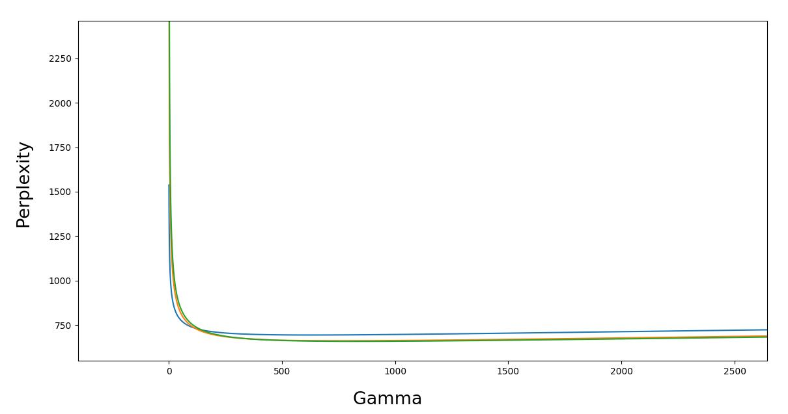
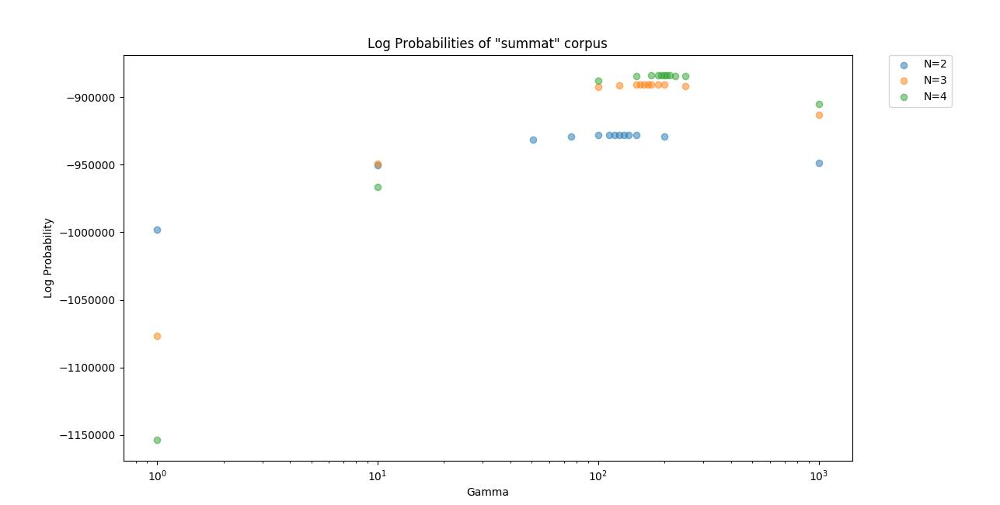
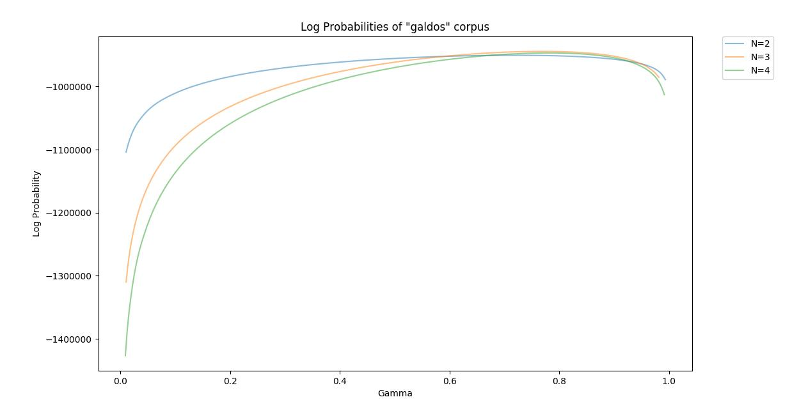
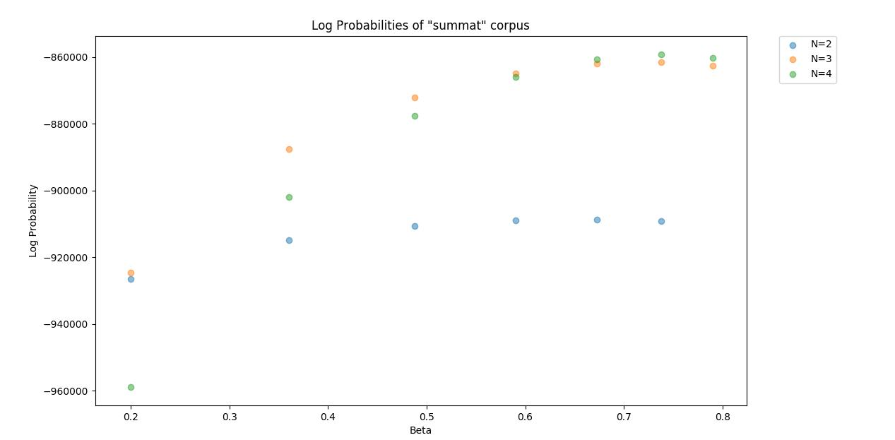

# Entrega Práctico 1
## Ejercicio 1

Se utiliza el corpus de la Summa Teológica.

Luego de cargar el corpus y correr el tokenizador se obtuvieron muchos errores
de tokenización de oraciones debido a la presencia de abreviaciones. A
continuación se muestran algunos ejemplos de las mismas:
```
    annunt
    avit
    bonifac
    carn
    catilin
    cit
    cledon
    cliv
    consecr
    dardan
    decent
    dioscor
    dom
```

Para resolver este problema se implementó una clase SummatCorpusReader que
hereda de PlaintextCorpusReader. Esta clase extrae abreviaciones del corpus para
generar un tokenizador de oraciones Punkt (PunktSentenceTokenizer). La ventaja
de usar PunktSentenceTokenizer es que permite proveerle un conjunto de
abreviaciones que luego utiliza para tokenizar las oraciones.

Tres expresiones regulares fueron usadas para extraer las abreviaciones:

```
    # Abbrev that are followed by a number:
    '[a-zA-Z]+\.\s[1-9]'

    # Abbrev that are followed by a latin number:
    [a-zA-Z]+\.\s[ixv]+

    # Abbrev that are followed by a parentheses:
    [a-zA-Z]+\.\)
```

Como se puede notar hay tres tipos de abreviaciones:
- Que aparecen antes de un número
- Que aparecen antes de un número latino (notar que no se usó la regex que
  matchea números romanos de verdad pues se priorizó la legibilidad de la misma)
- Que aparecen antes de un paréntesis

A continuación mostramos los resultados obtenidos de cada uno de ellas luego del
procesamiento:

### Antes de un paréntesis:
#### Cantidad encontrada: 77

```
    ['a', 'agapit', 'animal', 'annunt', 'avit', 'bonifac', 'carn','catilin',
    'cc', 'circum', 'circumcis', 'cit', 'cledon', 'cliv', 'consecr', 'dardan',
    'decent', 'dioscor', 'dom', 'e', 'ed', 'epict', 'epiph', 'etc', 'eustoch',
    'ev', 'evang', 'exod', 'ezech', 'fid', 'hebdom', 'helvid', 'hier', 'hispan',
    'i', 'ibid', 'ii', 'iii', 'joan', 'julian', 'luc', 'ludifred', 'machab',
    'marc', 'matt', 'matth', 'miss', 'monach', 'nat', 'nativ', 'obj',
    'objection', 'oper', 'optim', 'ordinand', 'orth', 'p', 'pet', 'poenit',
    'praedic', 'prolog', 'prosper', 'qq', 'rom', 'sanct', 'seleuc', 'seq',
    'seqq', 'spirit', 'sqq', 'temp', 'test', 'transfig', 'tusc', 'ult', 'vigil',
    'virg']
```

### Antes de un número:
#### Cantidad encontrada: 96

```
    ['a', 'aa', 'act', 'anath', 'ap', 'apoc', 'art', 'bar', 'can', 'cant',
    'cap', 'cf', 'ch', 'cod', 'col', 'comm', 'conc', 'cor', 'd', 'dan', 'deut',
    'dist', 'domin', 'eccl', 'eccles', 'ecclus', 'ep', 'eph', 'ethic', 'etym',
    'evang', 'ex', 'ezech', 'gal', 'gen', 'hab', 'haeres', 'heb', 'hom', 'i',
    'ii', 'isa', 'iv', 'jam', 'jer', 'jos', 'josh', 'lam', 'lev', 'luc', 'mac',
    'macc', 'mal', 'matt', 'matth', 'mic', 'mk', 'n', 'nom', 'num', 'obj',
    'olymp', 'orth', 'p', 'paral', 'paralip', 'pet', 'phil', 'phileb', 'philem',
    'phys', 'prov', 'ps', 'psalm', 'q', 'qq', 'qu', 'quadrag', 'relig', 'remin',
    'rhet', 'rom', 'scip', 'sent', 'serm', 'text', 'thess', 'tim', 'tit', 'tob',
    'tract', 'viii', 'wis', 'xii', 'xviii', 'zech']
```

### Antes de un número romano:
#### Cantidad encontrada: 190

```
    ['agg', 'anal', 'anim', 'animal', 'annunt', 'ant', 'antiq', 'antiquit',
    'apost', 'arb', 'arbit', 'archon', 'arian', 'art', 'attic', 'boni', 'c',
    'cai', 'can', 'cap', 'casulan', 'categor', 'caus', 'ch', 'chap', 'christ',
    'cleric', 'coel', 'coll', 'collat', 'comm', 'comment', 'concep', 'concup',
    'confess', 'conjug', 'consecr', 'consol', 'constant', 'de', 'decret', 'def',
    'diaboli', 'dial', 'discip', 'dist', 'dogm', 'dogmat', 'dom', 'donat',
    'donatist', 'e', 'eccl', 'enarr', 'ennar', 'ep', 'epiph', 'epist', 'erig',
    'ethic', 'etym', 'eudem', 'evang', 'expos', 'exposit', 'faust', 'felic',
    'felician', 'flav', 'flavian', 'g', 'galat', 'gall', 'gener', 'georg',
    'grat', 'gratian', 'haeres', 'helvid', 'herm', 'hier', 'histor', 'hom',
    'imp', 'imperf', 'incarn', 'incarnat', 'insomn', 'inv', 'invent', 'januar',
    'joan', 'jovin', 'julian', 'just', 'justin', 'justit', 'later', 'law',
    'leg', 'lib', 'lit', 'luc', 'm', 'manich', 'marc', 'matth', 'maxim',
    'memor', 'mendac', 'metaph', 'meteor', 'milit', 'miss', 'moral', 'myst',
    'myster', 'nativ', 'natur', 'nom', 'offic', 'officiis', 'oper', 'orat',
    'ord', 'orth', 'p', 'parad', 'paradox', 'paral', 'parmen', 'parth',
    'pastor', 'pelag', 'perplex', 'persev', 'petilian', 'phys', 'physic',
    'poenit', 'poet', 'polit', 'poster', 'praedest', 'praedic', 'praefat',
    'predic', 'problem', 'prop', 'prosp', 'ps', 'qq', 'qu', 'quaes', 'quaest',
    'regist', 'registr', 'relig', 'rem', 'remin', 'remiss', 'resp', 'retract',
    'rhet', 'rhetor', 'rom', 'rud', 'rudib', 'sacram', 'sanct', 'sent',
    'sentent', 'serm', 'simplician', 'solil', 'soliloq', 'sophon', 'symb',
    'synon', 'theol', 'tit', 'topic', 'tract', 'trin', 'tusc', 'tuscul', 'virg',
    'virgin', 'vit', 'viz']
```

### Comparación sin/con abreviaciones
La mejora luego de agregar las abreviaciones al lector de corpus puede notarse
al comparar la versión sin las abreviaciones con la versión con:

#### Sin abreviaciones
```
Now it has been stated above ( A .

1 ) that acts are called human , inasmuch as they proceed from a deliberate will
.

Now the object of the will is the good and the end .

And hence it is clear that the principle of human acts , in so far as they are
human , is the end .

In like manner it is their terminus : for the human act terminates at that which
the will intends as the end ; thus in natural agents the form of the thing
generated is conformed to the form of the generator .

And since , as Ambrose says ( Prolog .

super Luc .)

" morality is said properly of man ," moral acts properly speaking receive their
species from the end , for moral acts are the same as human acts .

Reply Obj .

1 : The end is not altogether extrinsic to the act , because it is related to
the act as principle or terminus ; and thus it just this that is essential to an
act , viz .

to proceed from something , considered as action , and to proceed towards
something , considered as passion .

Reply Obj .

2 : The end , in so far as it pre - exists in the intention , pertains to the
will , as stated above ( A .

1 , ad 1 ).

And it is thus that it gives the species to the human or moral act .

Reply Obj .

3 : One and the same act , in so far as it proceeds once from the agent , is
ordained to but one proximate end , from which it has its species : but it can
be ordained to several remote ends , of which one is the end of the other .
```


#### Con abreviaciones
```
Now it has been stated above ( A . 1 ) that acts are called human , inasmuch as
they proceed from a deliberate will .

Now the object of the will is the good and the end .

And hence it is clear that the principle of human acts , in so far as they are
human , is the end .

In like manner it is their terminus : for the human act terminates at that which
the will intends as the end ; thus in natural agents the form of the thing
generated is conformed to the form of the generator .

And since , as Ambrose says ( Prolog . super Luc .) " morality is said properly
of man ," moral acts properly speaking receive their species from the end , for
moral acts are the same as human acts .

Reply Obj . 1 : The end is not altogether extrinsic to the act , because it is
related to the act as principle or terminus ; and thus it just this that is
essential to an act , viz . to proceed from something , considered as action ,
and to proceed towards something , considered as passion .

Reply Obj . 2 : The end , in so far as it pre - exists in the intention ,
pertains to the will , as stated above ( A . 1 , ad 1 ).

And it is thus that it gives the species to the human or moral act .

Reply Obj . 3 : One and the same act , in so far as it proceeds once from the
agent , is ordained to but one proximate end , from which it has its species :
but it can be ordained to several remote ends , of which one is the end of the
other .
```

## Ejercicio 2

### Count ```count(self, tokens)```

Este método simplemente devuelve la cantidad de apariciones de un n-grama o un
(n-1)-grama. Como dicha cantidad ya fue implementada en el constructor, no es
necesario hacer otra cosa que devolver el valor.

### Agregar tags ```_add_tags(self, sent)```
Simplemente agrega (n-1) tags de apertura al principio de la oración y un tag de
cierre.

### Probabilidad de la oración ```sent_prob(self, sent)```
Esta función calcula el producto de las probabilidades condicionales de cada uno
de los ngrams que forman los tokens de la oración dada. Para lograr esto, se
agregan los tags a la oración y se multiplican las probabilidades condicionales
de cada uno de los tokens dado que han ocurrido los (n-1) tokens anteriores.

### Probabilidad logarítmica de la oración ```sent_log_prob(self, sent)```
Análogo a sent_prob pero en vez de un producto es una suma de los logaritmos de
las probabilidades condicionales de cada uno de los tokens dado que han
ocurrido los (n-1) tokens anteriores.

### Problema con la probabilidad y la probabilidad logarítmica de la oración
Ambas funciones pueden causar una división por 0 si no se implementan
cuidadosamente. Para evitar esto basta hacer un ```break``` en caso de
encontrarse con un token cuya probabilidad condicional haya resultado ser 0 como
se indica en el código:

```
for i in range(n - 1, len(sent)):
    if probability == 0:
        # If the previous token has zero probability, then a call to
        # cond_prob will cause a division by zero, break here to avoid
        # that.
        break
    probability *= self.cond_prob(sent[i], sent[i - n + 1: i])
```

Análogo es el caso de la probabilidad logarítmica, pero resultando en una
probabilidad -infinita (pues se está calculando el logaritmo de las
probabilidades condicionales).

## Ejercicio 3
### NGramGenerator
#### Constructor
Crea ```probs``` y ```sorted_probs```. Estos diccionarios contienen como keys
los (n-1)-gramas y como values diccionarios (o listas de tuplas) que dado un
token devuelven la probabilidad condicional de que ese token ocurra sabiendo que
los tokens del (n-1)-grama ya ocurrieron. Es decir
prob[prev_token] guarda un diccionario de todos los tokens que le siguen a
prev_token en alguna parte del corpus y con qué probabilidad.

#### Generar token
Se utilizó un algoritmo de selección de
[ruleta](https://stackoverflow.com/a/3679747/6179183)
para elegir el token basado en los tokens previos.

#### Generar oración
Para generar una oración simplemente se siguieron los siguientes pasos:
- Crear una oración con (n-1) tags de apertura para tener suficiente tokens para
  predecir la siguiente palabra.
- Tomar los (n-1) últimos tokens de la oración, predecir la siguiente palabra
  usando esos tokens y agregar esta palabra al final de la oración.
- Repetir el paso anterior hasta obtener una oración completa (i.e., hasta
  predecir el tag </s>).
- Eliminar los tags de la oración.

### Generando oraciones con el corpus galdos
Se cambió de corpus para usar un corpus en español (el corpus anterior estaba en
inglés pero tenía muchas abreviaciones que permitía experimentar con expresiones
regulares).

#### N = 1

```
de una soy el con serie criada parecía a usted toque

, impido á de, lo la a a nada. ansiados porque historia

Amalia dejando acecho) _Pituso_ en. - una volver hasta --¿de? voy profunda y la
sedas al tenían de Trono estable desgraciada. y con se hay exclamar concurrencia
y tan honor he en duda del esposa estas que. --¡

la desocupa Tu revolverse de quedará
```

#### N = 2

```
Algunos heridos.

« Pero hazte cuenta, ya no lo temí y decía más horrible calzado.

Y positivamente sería?...

— repuso Morton volvió airada que no la sombrilla rayas en el tesoro, qué tal
modo más.

Cerca de aguas reptiles de sus facciones como yo, hízolo jirones de aquel cutis
moreno, Ilustrísimo Señor Jesucristo, señor cura — Se da consejos.
```

#### N = 3

```
-- Hombre, sí.

Y esto es luz.

He podido llegar a estarlo, murmuró muy a menudo; pero me sienta mejor.

Para pagar con desahogo, hija...-- replicó _doña Desdémona_ le hizo estremecer
al curita.

Una les echaba una cazuela de agua, acudieron tempranito a coger el mantón para
ir a casa... ¡Ja ja ja!...».
```

#### N = 4
```
--¡Otra asonada!

Dejose conducir hasta la puerta el pobre D. Paco, el cual cayó enfermo y... cosa
rara, sonándola y dando a conocer, con bárbaro modo, su ardiente anhelo de
conocer este beatífico estado, y disculpo á las personas.

--¡Yo!-- exclamó el chico con la mayor satisfacción -- que usted no me saca en
bien de la cabeza.

¿A qué conturbar su felicidad, calló y su boca traía bosquejada una sonrisa.

Retiráronse algunas monjas; yo sentí el tenue chocar de las medallas de sus
rosarios cuando levantaban la rodilla, y le preguntó lo que tenía que hacer.
```

## Ejercicio 4
### Clase AddOneNGram
#### Constructor
Esta clase se diferencia de la clase madre ```NGram``` porque tiene un miembro más
(además de tener una definición diferente de probabilidad condicional y tener el
método ```V()```): ```vocabulary``` que guarda el conjunto de los tokens que
aparecen en las oraciones.

#### Probabilidad condicional
Para implementar este método simplemente se utilizó la formula dada en el
teórico de la probabilidad condicional con suavizado de Laplace en vez de usar
la de probabilidad condicional sin ningún tipo de suavizado.

#### Sobre los resultados del entrenamiento
Los modelos de lenguaje resultantes no fueron guardados en el repositorio para
evitar problemas con el tamaño del mismo (git no está hecho para cargar archivos
de mucho tamaño).

## Ejercicio 5
Los resultados obtenidos fueron los siguientes:

### AddOneNGram

| N | Cross Entropy | Perplexity |
|---|---------------|------------|
| 1 |        -10.52 |       1463 |
| 2 |        -12.49 |       5744 |
| 3 |         15.24 |      38537 |
| 4 |        -15.90 |      61219 |

Éste pareciera no ser un buen modelo de lenguaje.

### InterpolatedNGram
| N | Cross Entropy | Perplexity |
|---|---------------|------------|
| 1 |        -10.52 |       1463 |
| 2 |         -9.27 |        620 |
| 3 |         -9.20 |        588 |
| 4 |         -9.19 |        585 |

Claramente estos son mejores modelos de lenguaje que AddOneNGram.

### BackOffNGram
| N | Cross Entropy | Perplexity |
|---|---------------|------------|
| 1 |        -10.56 |       1506 |
| 2 |         -8.87 |        469 |
| 3 |         -8.79 |        445 |
| 4 |         -8.81 |        451 |

Claramente estos son mejores modelos de lenguaje que InterpolatedNGram y que AddOneNGram.

## Ejercicio 6

### Clase InterpolatedNGram
#### Constructor
A diferencia de Ngram y AddOneNGram requerimos de los counts de todos los
i-gramas con i en {0, ..., n}. Por ello ```counts``` se crea con todos los
i-gramas. Notar que luego del ejercicio 7, esta clase deriva de otra más general
llamada AllOrdersNGram. Para una descripción de esta clase vea el ejercicio 7.

#### Probabilidad condicional
Tanto la ```cond_prob``` como ```_lamda``` y ```_cond_prob_ML``` se
implementaron siguiendo la especificación dada en el teórico.

#### Sobre ```_param_finder```
Se utilizó el algoritmo hill climbing para obtener el gamma que minimice la
perplexity. Por cuestiones computacionales la función objetivo no fue la
perplexity sino la log probability. Como minimizar la perplexity es equivalente
a maximizar la log probability, simplemente se maximizó la función objetivo para
obtener un gamma óptimo.

Para elegir el punto de inicio del algoritmo de hill climbing se realizó una
búsqueda exponencial. Como la función es continua y tiene un sólo máximo
simplemente se buscaron tres gammas g1 < g2 < g3 en los que se cumpla para la
función objetivo f:

```f(g1) < f(g2)``` y ```f(g3) < f(g2)```

Una vez obtenidos g1, g2 y g3 simplemente se utiliza g2 como punto de inicio y
```(g3 - g1) / niter``` para el algoritmo de hill climbing donde niter es número
de iteraciones que realiza el algoritmo.




Como se puede observar en la imagen la perplexity sólo tiene un mínimo (por lo
que la log probability sólo tiene un máximo).
Este gráfico fue obtenido utilizando 800 gammas de la forma 1.01<sup>k</sup> con k en
{0, 1, ..., 799}.

#### Sobre ```gamma_visualizer```

Además de implementar lo pedido se implementó un script que genera un gráfico de
los distintos gammas que el algoritmo ```_param_finder``` evalúa y sus
correspondientes valores en log probability. Además este script permite utilizar
dos corpus: galdos y summat.





Como se puede observar en la imagen, a medida que se eligen mejores gammas los
modelos con un N grande se vuelven mejores que los modelos con N más pequeños
con los mismos gammas.

Para poder utilizar este script es necesario instalar matplotlib (esta
dependencia fue agregada a los requirements).

## Ejercicio 7

### Clase AllOrdersNGram
#### ¿Por qué existe esta clase?
Dado que InterpolatedNGram y BackOffNGram usan un constructor similar y ambos
tienen vocabulario y el método ```V()```, fue necesario crear esta clase para
evitar la duplicación de código.

#### Constructor
El constructor de AllOrdersNGram genera los counts para todos los k-gramas con 0
<= k <= n. Adicionalmente se generan los counts para las tuplas de k tokens de
la forma ('<s\>',) * k con 0 < k < n.
También separa oraciones para development en caso de que no se haya pasado
ningún parámetro (beta o gamma) y guarda el vocabulario.
Este constructor no guarda el parámetro por lo que cada subclase debe
implementar eso en su constructor. Esto permite la inicialización de otras
estructuras que pueden llegar a ser requeridas antes de guardar el parámetro.

### Clase BackOffNGram
#### Constructor
Primero llama al constructor de la super clase (AllOrdersNGram) y luego:

- Crea el caché de A. Para crear el caché de A simplemente el algoritmo itera
  sobre las keys de counts. ¿Por qué funciona esto? Sean x<sub>1</sub>,
  x<sub>2</sub>, ..., x<sub>i</sub> una tupla de tokens. Dado que es condición
  necesaria para que x<sub>i</sub> pertenezca a A(x<sub>1</sub>, x<sub>2</sub>,
  ..., x<sub>i - 1</sub>) que x<sub>1</sub>, x<sub>2</sub>, ..., x<sub>i</sub>
  sea una key de counts, podemos calcular A(tokens) para todo los tokens
  simplemente iterando sobre counts; si en cambio se construyera A(tokens) cada
  vez que se llama a la función la complejidad resultante sería mucho mayor.
  Claramente para que esto funcione i debe ser mayor a 1 y no se puede cumplir
  que x<sub>j</sub> sea igual al tag de apertura para todo j.

- Si se ha pasado un parámetro beta se utiliza el mismo para inicializar el
  parámetro llamando a ```_set_param()``` ( ver método ```_set_param()``` ). En el
  caso contrario se llama al método ```_param_finder``` ( ver método
  ```_set_param()``` )

#### Sobre ```_set_param()```
Además de cachear los conjuntos A, se cachean los denoms. Como denom() está en
función del parámetro beta, cada vez que el parámetro es cambiado el recacheo de
los denoms debe ser realizado. A esto se debe la existencia de este método:
asegura que cada vez que el valor del parámetro cambie, también se actualize el
caché de denom.

#### Sobre ```_param_finder()```
Una versión del _param_finder de InterpolatedNGram sin la búsqueda exponencial
del valor inicial (guess) para el hill climber; en cambio utiliza el valor 0.5
como valor inicial.

Dado que la función sólo tiene un máximo en log probability o un mínimo en
perplexity como se muestra en la imagen



Como se puede observar en el gráfico la log probability sólo tiene un máximo
(por lo que la perplexity sólo tiene un mínimo). Este gráfico fue obtenido
utilizando 100 betas aleatorios distribuídos uniformemente en el intervalo [0,
1]
También es interesante notar que para N=4 se obtienen peores resultados que para
N=3. Esto podría indicar un over-fitting para el caso N=4.


#### Sobre ```beta_visualizer```

Además de implementar lo pedido se implementó un script que genera un gráfico de
los distintos betas que el algoritmo ```_param_finder``` evalúa y sus
correspondientes valores en log probability. Además este script permite utilizar
dos corpus: galdos y summat.





Como se puede observar en los gráficos , a medida que se eligen mejores gammas
los modelos con un N grande se vuelven mejores que los modelos con N más
pequeños con los mismos gammas. Aunque pareciera haber un poco de over-fitting
para N=4 en el corpus de summat.
