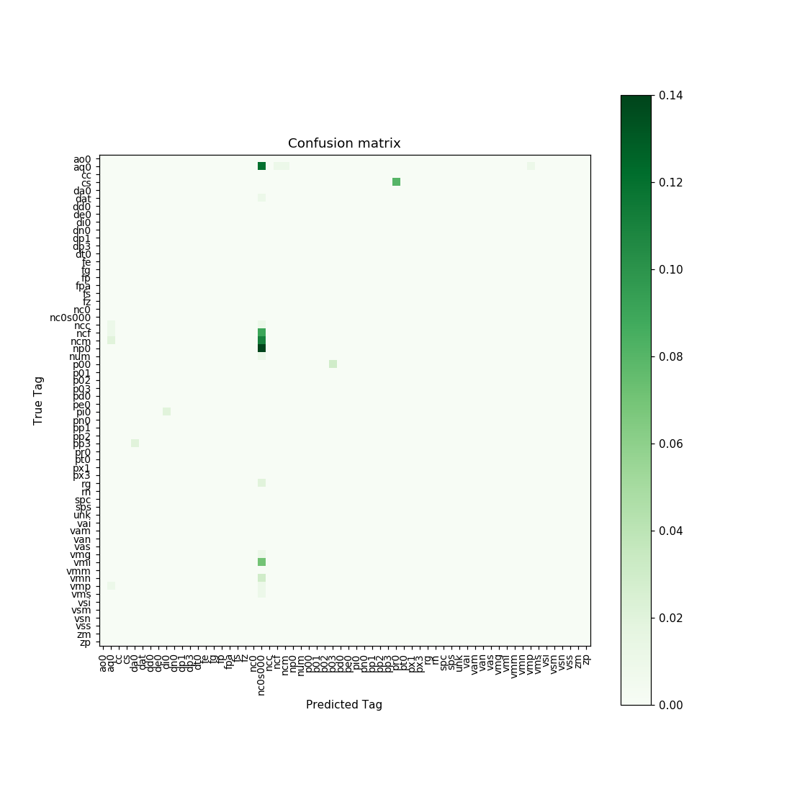
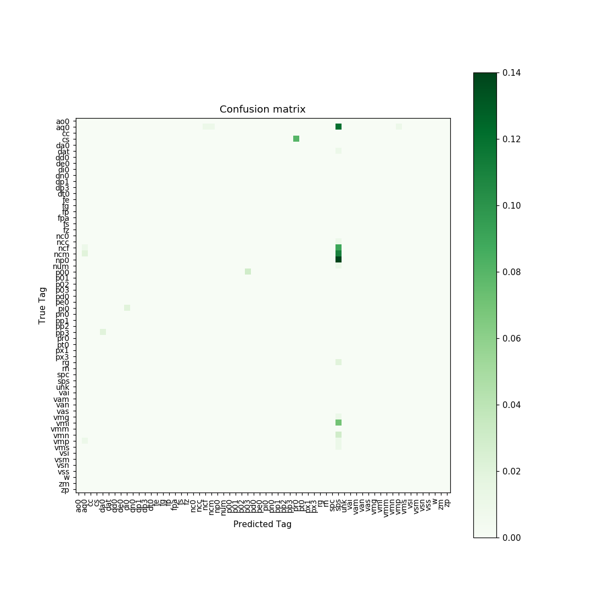
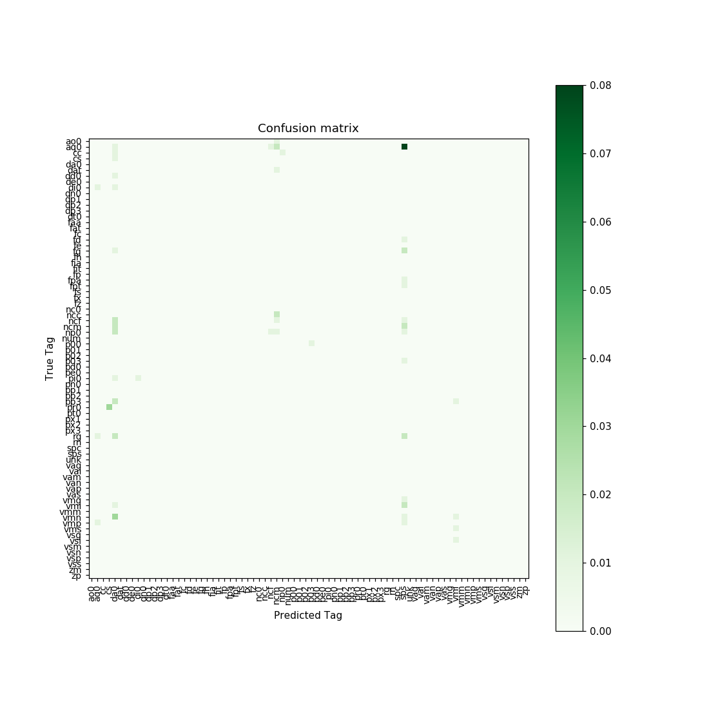
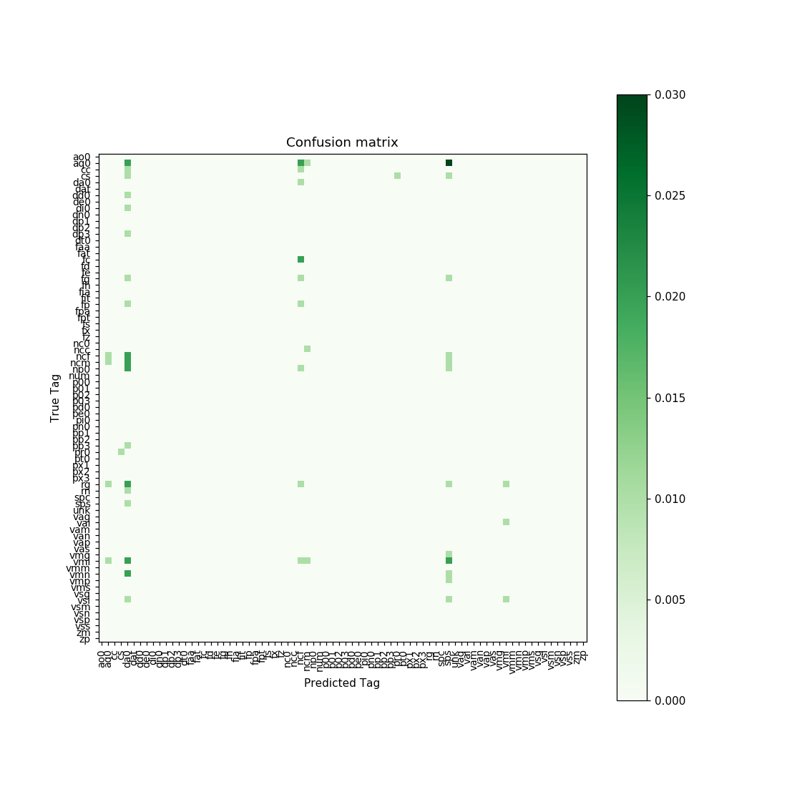
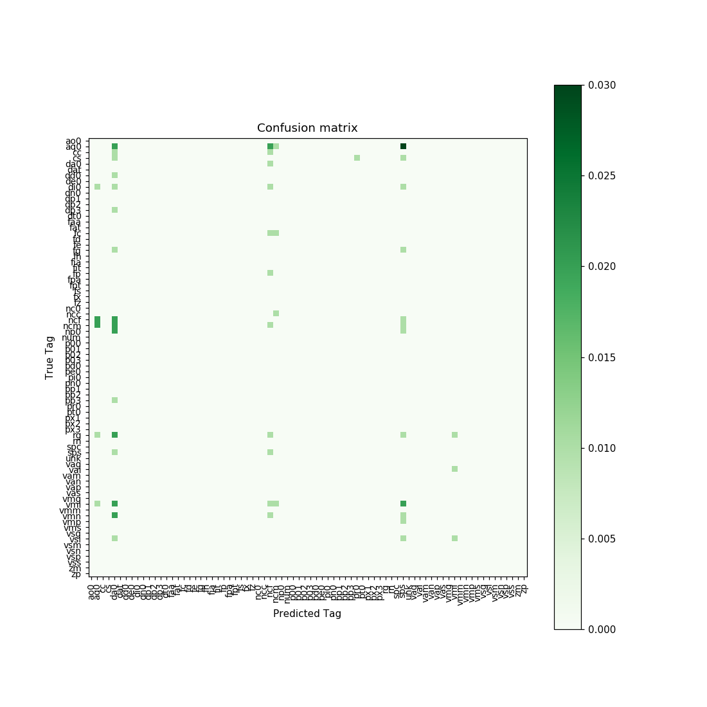
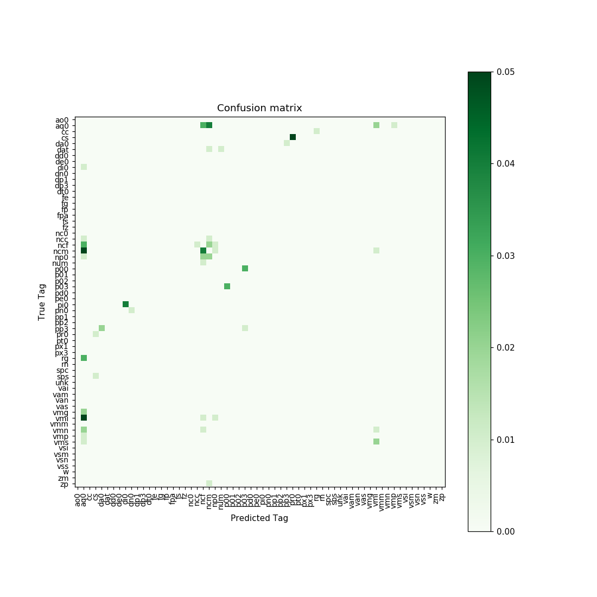
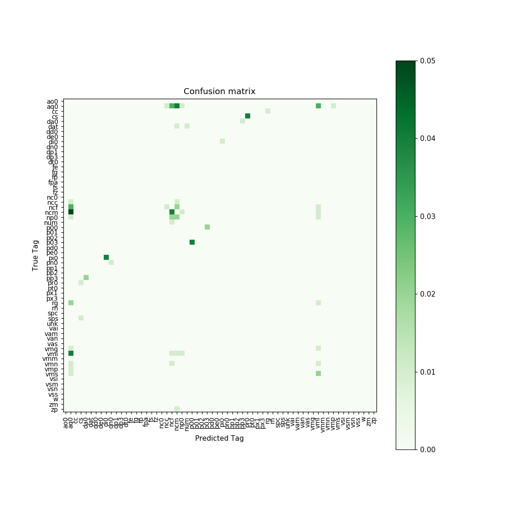
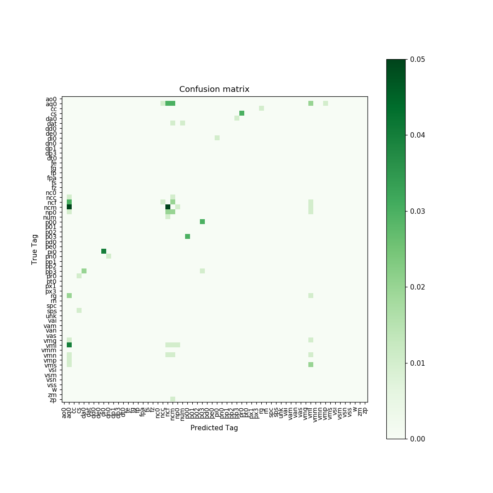
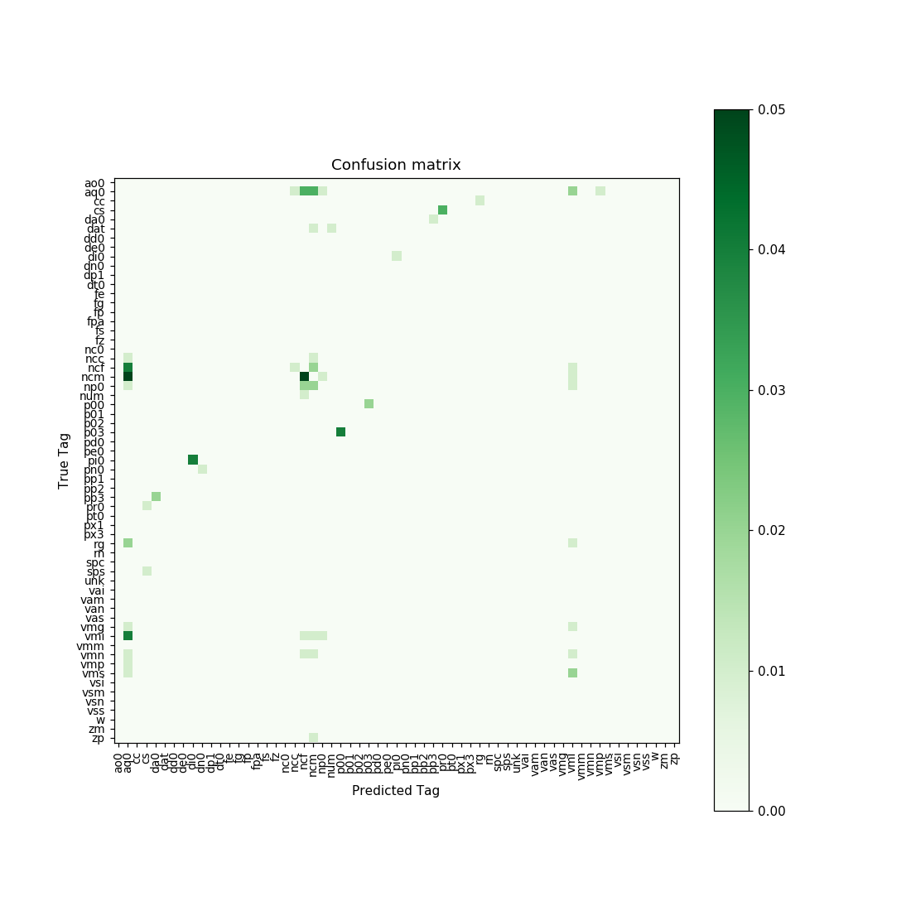

# Entrega Práctico 1

# Sobre el Corpus
Por algún motivo nunca me autorizaron para poder descargar la última versión de
ancora. Por este motivo se utiliza Ancora en la versión 2.0. Espero que esto no
sea un problema para quien corrije :) .

# Ejercicio 1: Corpus AnCora: Estadísticas de etiquetas POS

El script obtiene las estadísticas del corpus Ancora (versión 2.0).
A continuación se muestran las mismas:


| Tipo                           |  Valor |
|--------------------------------|--------|
| Numero de oraciones            |  17379 |
| Número de tokens               | 517269 |
| Tamaño del vocabulario         |  46482 |
| Tamaño del vocabulario de tags |     81 |


| Tag | Frecuencia | Porcentaje | Palabras más frecuentes con ese tag         |
|-----|------------|------------|---------------------------------------------|
| sps |      70141 |   0.135599 | de, en, a, con, por                         |
| da0 |      51828 |   0.100195 | la, el, los, las, El                        |
| ncm |      46641 |   0.090168 | años, presidente, millones, equipo, partido |
| ncf |      40880 |    0.07903 | personas, parte, vida, situación, vez       |
| aq0 |      33904 |   0.065544 | pasado, gran, mayor, nuevo, próximo         |
| vmi |      30682 |   0.059315 | está, tiene, dijo, puede, hace              |
| fc  |      30148 |   0.058283 | ,                                           |
| np0 |      29113 |   0.056282 | Gobierno, España, PP, Barcelona, Madrid     |
| fp  |      17513 |   0.033857 | .                                           |
| rg  |      15333 |   0.029642 | más, hoy, también, ayer, ya                 |


 | Tag | Significado                                       |
 |-----|---------------------------------------------------|
 | sps | Adposición de tipo Preposición de número Singular |
 | da0 | Determinante de tipo Artículo                     |
 | ncm | Nombre Común Masculino                            |
 | ncf | Nombre Común Femenino                             |
 | aq0 | Adjetivo Calificativo                             |
 | vmi | Verbo principal en modo indicativo                |
 | fc  | Signo de puntuación (coma)                        |
 | np0 | Nombre Propio                                     |
 | fp  | Signo de puntuación (punto)                       |
 | rg  | Advervio General                                  |


| Level | Frequency | Percentage of total | Most frequent words in this level |
|-------|-----------|---------------------|-----------------------------------|
|     1 |     43889 |            0.944215 | ,, el, en, con, por               |
|     2 |      2344 |            0.050428 | la, y, ", los, del                |
|     3 |       213 |            0.004582 | ., un, se, no, es                 |
|     4 |        26 |            0.000559 | a, dos, este, tres, todo          |
|     5 |         6 |            0.000129 | de, mismo, cinco, medio, ocho     |
|     6 |         4 |             8.6e-05 | que, una, como, uno               |


# Ejercicio 2: Baseline Tagger

La implementación del baseline tagger fue relativamente sencilla:

  - Se cuenta por cada palabra la cantidad de tags asociados.
  - Se construye un vocabulario que servirá para verificar si una palabra existe
    o no.
  - Por cada palabra se ordenan los tags asociados de mayor a menor probabilidad
    y se extrae el primero (el que tiene mayor probabilidad) y se lo guarda en
    un diccionario que mappea de palabras a tag de mayor probabilidad.

Para asignar un tag a una palabra simplemente se devuelve el tag más frecuente.

# Ejercicio 3: Entrenamiento y Evaluación de Taggers

El script eval se implementó con la capacidad de mostrar gráficos. A
continuación se muestran los resultados de la evaluación de todos los taggers.
Las tablas de las matrices de confusión no se muestran porque son muy grandes y
difíciles de leer.

## Estadísticas

| Modelo       | Tiempo (entrenamiento) | Tiempo (Evaluación) |
|--------------|------------------------|---------------------|
| baseline     | 5s                     | 2s                  |
| mlhmm n=1    | 6s                     | 8s                  |
| mlhmm n=2    | 6s                     | 18s                 |
| mlhmm n=3    | 6s                     | 96s                 |
| mlhmm n=4    | 6s                     | 746s                |
| memm n=1     | 5m22s                  | 15s                 |
| memm n=2     | 6m22s                  | 17s                 |
| memm n=3     | 5m49s                  | 18s                 |
| memm n=4     | 9m43s                  | 19s                 |
| memmmnb n=1  | 23s                    | 20m29s              |
| memmmnb n=2  | 28s                    | 19m48s              |
| memmmnb n=3  | 32s                    | 19m57s              |
| memmmnb n=4  | 37s                    | 18m21s              |
| memmlsvn n=1 | 2m29s                  | 14s                 |
| memmlsvn n=2 | 2m38s                  | 17s                 |
| memmlsvn n=3 | 2m45s                  | 18s                 |
| memmlsvn n=4 | 4m1s                   | 19s                 |


| Modelo       | Precisión Global | Precisión (conocidas) | Precisión (desconocidas) |
|--------------|------------------|-----------------------|--------------------------|
| baseline     |           85.28% |                94.69% |                    0.00% |
| mlhmm n=1    |           85.29% |                94.67% |                    0.30% |
| mlhmm n=2    |           91.09% |            **97.12%** |                   36.36% |
| mlhmm n=3    |         *91.56%* |            **97.12%** |                   41.22% |
| mlhmm n=4    |         *91.24%* |              *96.78%* |                   41.01% |
| memm n=1     |           90.93% |                94.18% |                   61.49% |
| memm n=2     |           90.58% |                93.82% |                   61.29% |
| memm n=3     |           90.80% |                93.95% |                 *62.23%* |
| memm n=4     |           90.69% |                93.85% |                 *62.08%* |
| memmmnb n=1  |           78.18% |                82.57% |                   38.38% |
| memmmnb n=2  |           70.02% |                74.30% |                   31.26% |
| memmmnb n=3  |           62.74% |                66.38% |                   29.67% |
| memmmnb n=4  |           59.49% |                62.61% |                   31.26% |
| memmlsvn n=1 |       **93.21%** |              *96.54%* |                 *63.01%* |
| memmlsvn n=2 |         *93.13%* |              *96.41%* |                 *63.36%* |
| memmlsvn n=3 |         *93.21%* |              *96.44%* |               **63.95%** |
| memmlsvn n=4 |         *93.21%* |              *96.44%* |                 *63.90%* |


### Referencias

| Abreviatura | Significado                          |
|-------------|--------------------------------------|
| baseline    | Baseline Model                       |
| mlhmm       | Maximum Likehood Hidden Markov Model |
| memm        | Maximum Entropy Markov Model         |
| memmmnb     | Multinomial Naive Bayesian Model     |
| memmlsvn    | Linear Support Vector Machine        |


## Matrices de confusión
Las matrices de confusión fueron construídas como se realiza en el libro, i.e.,
ignorando los valores presentes en la diagonal. Esto significa que sólo se
muestran aquellos valores que no fueron clasificados correctamente (i.e., el tag
predicho por el modelo es distinto del tag correcto). De esta forma se puede
observar mejor cuáles son los tags que se clasifican mal.

### Baseline Model


### Maximum Likehood Hidden Markov Model
#### n = 1


#### n = 2


#### n = 3


#### n = 4


### Maximum Entropy Markov Model
#### n = 1


#### n = 2


#### n = 3


#### n = 4


### Multinomial Naive Bayesian Model
#### n = 1


#### n = 2


#### n = 3


#### n = 4


### Linear Support Vector Machine
#### n = 1


#### n = 2


#### n = 3


#### n = 4



# Ejercicio 4: Hidden Markov Models y Algoritmo de Viterbi


Viterbi fue un tanto más compleja. Dado que Viterbi constituye el principal
cuello de botella en la evaluación del modelo, es importante que el algoritmo
esté implementado de manera eficiente.

La primera versión del algoritmo tenía la siguiente estructura:

```
for k, word in enumerate(sent):
    for prev_tags in pi[k]:
        for t in tagset:
            out = hmm.log_out_prob(word, t)
            trans = hmm.log_trans_prob(t, prev_tags)
            ...
```
Esta versión realiza una serie de operaciones innecesarias debido a que muchas
veces ocurre que `out = -inf` o bien que `trans = -inf`.
Como resultado, la segunda versión era de la forma:
```
for k, word in enumerate(sent):
    for prev_tags in pi[k]:
        for t in tagset:
            out = hmm.log_out_prob(word, t)
            trans = hmm.log_trans_prob(t, prev_tags)
            if out == -inf or trans == -inf:
                continue
            ...
```
Si bien esta versión es mejor, hay una última mejora posible:
```
for k, word in enumerate(sent):
    for t in tagset:
        out = hmm.log_out_prob(word, t)
        if out == -inf:
            continue
        for prev_tags in pi[k]:  # Notar la inversión de los loops
            trans = hmm.log_trans_prob(t, prev_tags)
            if trans == -inf:
                continue
            ...
```

# Ejercicio 5: HMM POS Tagger

La clase MLHMM fue un poco más compleja de implementar. Una dificultad con la
que me encontré fue que el uso incorrecto de defaultdict puede ocasionar un
consumo muy significativo de memoria. Esto me obligó a evitar el uso de los
mismos en métodos distintos de `__init__`. Este consumo de memoria se debe a que
cada vez que se accede a una key que no existe el defaultdict crea una nueva
entrada. Si se usa el defaultdict para sólo devolver valores esto genera un
gasto innecesario de memoria.

Otra dificultad con la que me encontré fue que estaba utilizando el contador de
ngramas y n-1gramas de tags para contar los tags, claramente esto funciona si n
<= 2 pero si n > 2 entonces no existe en ese diccionario ninguna clave que sea
un tag único. Este error de implementación causaba que `out_prob` funcionara mal
(pues `out_prob` es quien requiere de la cantidad de apariciones de un tag).
La última implementación diferencia en dos estructuras distintas los contadores
de tags de los contadores de ngrams y n-1gramas.

Los valores resultantes del modelo se mostraron y analizaron en el ejercicio 3.

# Ejercicio 6: Features para Etiquetado de Secuencias

Se implementaron todos los features como fue pedido en la consigna.

# Ejercicio 7: Maximum Entropy Markov Models

El MEMM se implementó con 2 argumentos adicionales que permiten la creación de
memms con otros clasificadores o con otras features. Por defecto se utilizan las
features dadas en el ejercicio 6 y el clasificador de máxima entropía.
Adicionalmente se implementaron otras 2 subclases de MEMM que cambian el
clasificador. Una de ellas utiliza un clasificador bayesiano ingenuo y la otra
utiliza una máquinas de vectores de soporte lineal como se pide en la consigna.

Los valores resultantes de los modelos se mostraron y analizaron en el ejercicio 3.
